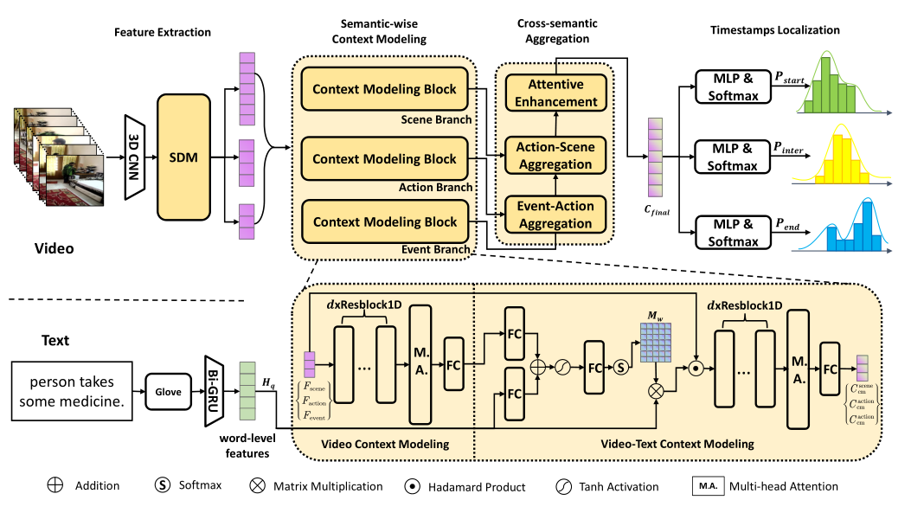
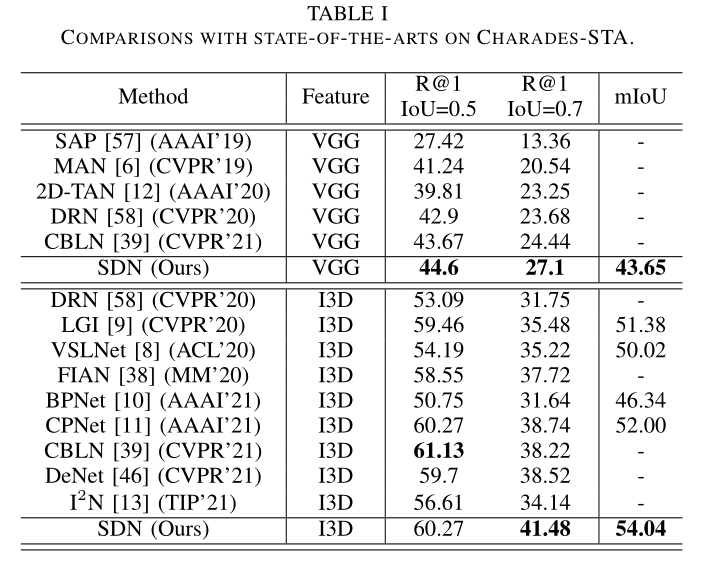
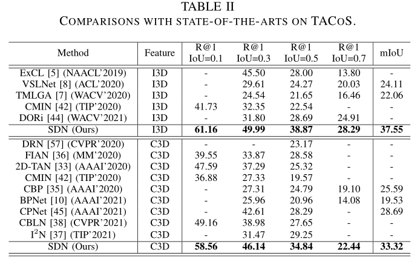
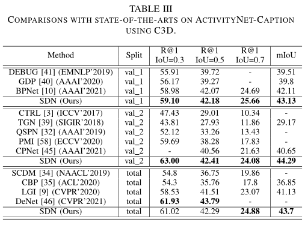
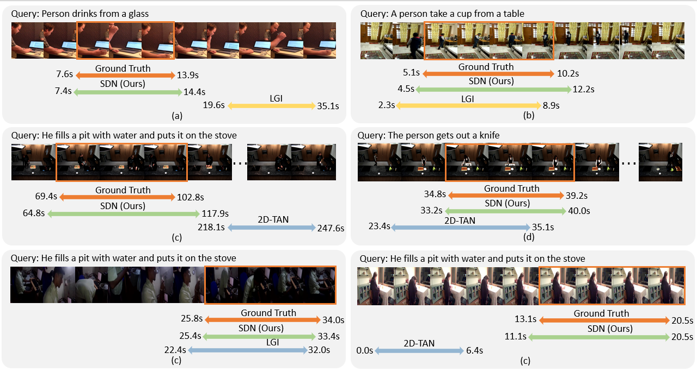
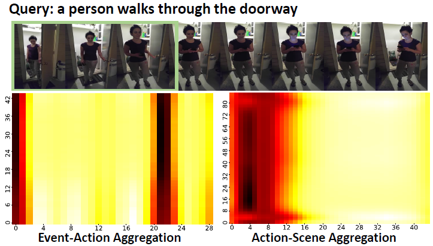
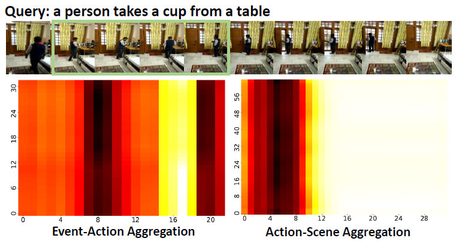
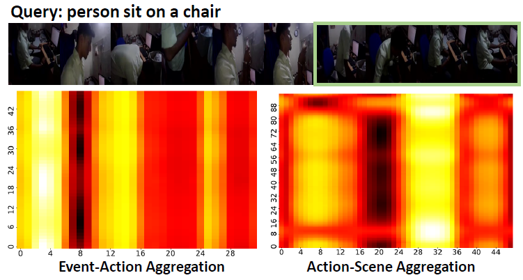
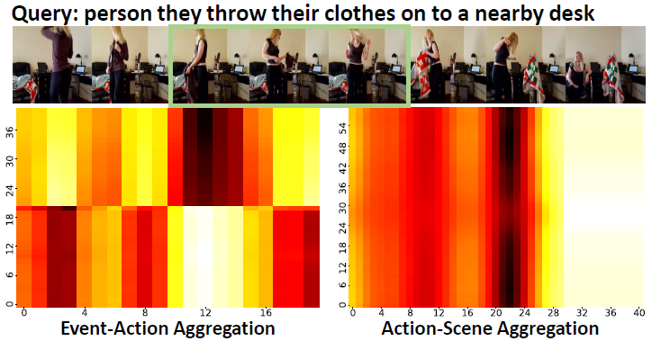

# Introduction

This is the implementation code and instruction of the proposed work  *"SDN: Semantic Decoupling Networks for Temporal Language Grounding"* (SDN).

## Semantic Decoupling Networks

Temporal Language Grounding is one of the challenging cross-modal video understanding tasks, which aims at retrieving the most relevant video segment from an untrimmed video according to a natural language sentence. The existing method can be separated into two dominant types: proposal-based and proposal-free methods.  

However, the constant-scale candidates in proposal-based methods limit the localization precision and bring extra computing consumption. Contrastively, the proposal-free methods perform well on high-precision based on the fine-grained features but suffer from the lack of segment-level interactions, which causes degeneration when the video becomes complex.  

We propose a novel framework termed Semantic Decoupling Network (SDN), which combines the advantages of proposal-based and proposal-free methods and overcome their defects. It contains three key components: Semantic Decoupling Module (SDM), Context Modeling Block (CMB), Cross-semantic Aggregation. By capturing the video-text contexts in multi-level semantics, the SDM and CMB effectively utilize the benefits of proposal-based methods. Meanwhile, the Cross-semantic Aggregation module maintains the merits of proposal-free methods that localizing timestamps precisely.



<!-- **Insight of Our Work** -->
## Insight of Our Work

1. We propose the Semantic Decoupling Network, which inherits the benefits of proposal-based and proposal-free methods and overcomes their defects.
2. To utilize the merits of proposal-based methods, we propose the Semantic Decoupling Module to decompose visual features and the Context Modeling Block to mine the contexts in each semantic branch.
3. To maintain the advantages of proposal-free methods, we design the Cross-semantic Aggregation mechanism that integrates the three kinds of contexts into fine-grained features with plentiful semantics. It keeps the flexibility of temporal localization.
4. Our SDN outperforms recent state-of-the-art approaches. The extensive experiments demonstrate the effectiveness of combining the two methods.

# Training and Testing

## Running

Use the following command to train our model.

```Python
CUDA_VISIBLE_DEVICES=0 python main.py -c exps/TLG/ExpSDN_Charades_VGG.yaml
```

You can resume a checkpoint file by

```Python
CUDA_VISIBLE_DEVICES=0 python main.py -c exps/TLG/ExpSDN_Charades_VGG.yaml --resume $path to *.ckpt$
```

If you just want to evaluate a saved model file, use the following command.

```Python
CUDA_VISIBLE_DEVICES=0 python main.py -c exps/TLG/ExpSDN_Charades_VGG.yaml --test --load $path to *.best$
```

Use the following command to activate multi-gpu training:

```Python
CUDA_VISIBLE_DEVICES=0,1 python -m torch.distributed.launch --nproc_per_node=2 main.py -c exps/TLG/ExpSDN_Charades_VGG.yaml
```

Remember to change the dataset used at line 44 in main.py if you want to train the model on other datasets.

```Python
-main.py
     -line 44:   dsets, loader = charades_sta_vgg.create_loaders(self.cfg.loader_config)

```

# Overall Results

<!-- **Results on Charades-STA Dataset** -->
## Results on Charades-STA Dataset



<!-- **Results on TACoS Dataset** -->
## Results on TACoS Dataset



<!-- **Results on ActivityNet-Caption Dataset** -->
## Results on ActivityNet-Caption Dataset



<!-- **Visualization of What Our Model Care** -->

## Visualization of Moment-Text Retrieval



## Visualization of Cross-semantic Aggregation






# Acknowledge

We sincerely thank the following works for their video features and codes.

```ref
@inproceedings{mun_CVPR_2020,
  author    = {Jonghwan Mun and
               Minsu Cho and
               Bohyung Han},
  title     = {Local-Global Video-Text Interactions for Temporal Grounding},
  booktitle = {IEEE Conference on Computer Vision and Pattern Recognition},
  pages     = {10807--10816},
  year      = {2020},
}

@inproceedings{rodriguez_WACV_2021,
  author    = {Cristian Rodriguez Opazo and
               Edison Marrese{-}Taylor and
               Basura Fernando and
               Hongdong Li and
               Stephen Gould},
  title     = {DORi: Discovering Object Relationships for Moment Localization of
               a Natural Language Query in a Video},
  booktitle = {IEEE Winter Conference on Applications of Computer Vision},
  pages     = {1078--1087},
  year      = {2021},
}

@inproceedings{zhang_AAAI_2020,
  author    = {Songyang Zhang and
               Houwen Peng and
               Jianlong Fu and
               Jiebo Luo},
  title     = {Learning 2D Temporal Adjacent Networks for Moment Localization with
               Natural Language},
  booktitle = {AAAI Conference on Artificial Intelligence},
  pages     = {12870--12877},
  year      = {2020}
}
​```
